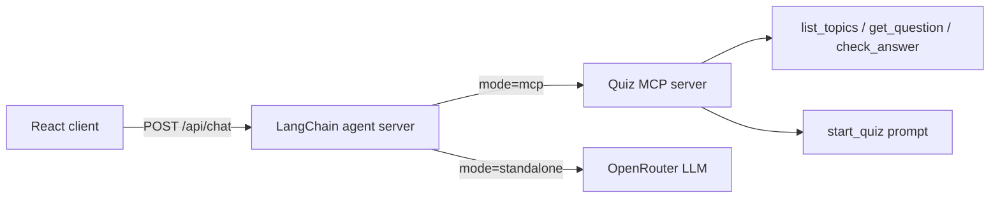

# Lab 10: MCP Quiz Agent

LangChain quiz agent with **two modes**:

1. **MCP connected** — agent connects to a Quiz MCP server (Streamable HTTP), uses `get_question` / `check_answer` tools, and is launched via the `start_quiz` MCP prompt.
2. **Standalone** — same quiz-master behavior without MCP; the LLM generates and evaluates questions itself.

The system prompt restricts the agent to **only ask questions and evaluate answers** — it never answers the quiz for the user.

Uses **OpenRouter** for the chat model.

## Architecture



## Setup

1. **MCP server** (port 3100):

   ```bash
   cd mcp-server
   npm install
   npm start
   ```

2. **Agent server** (port 3010):

   ```bash
   cd server
   cp .env.example .env
   # Set OPENROUTER_API_KEY
   npm install
   npm start
   ```

3. **Client** (dev, port 5176):

   ```bash
   cd client
   npm install
   npm run dev
   ```

   Or build and serve from the agent server:

   ```bash
   cd client && npm run build
   cd ../server && npm start
   # Open http://localhost:3010
   ```

## API

| Method | Path | Description |
|--------|------|-------------|
| `GET` | `/health` | Health check |
| `GET` | `/api/topics` | List quiz topics (via MCP) |
| `POST` | `/api/chat` | Send a message to the quiz agent |

### POST /api/chat

```json
{
  "mode": "mcp",
  "topic": "mcp",
  "messages": [{ "role": "user", "content": "..." }],
  "userMessage": "Model Context Protocol"
}
```

Response:

```json
{
  "reply": "Correct! Next question: ...",
  "mode": "mcp"
}
```

## MCP Server Tools

| Tool | Description |
|------|-------------|
| `list_topics` | Available quiz topics |
| `get_question` | Fetch next question for a topic |
| `check_answer` | Validate user answer |

## MCP Prompt

| Prompt | Args | Description |
|--------|------|-------------|
| `start_quiz` | `topicId` | Instructions to begin a quiz session |

## Environment

| Variable | Where | Description |
|----------|-------|-------------|
| `OPENROUTER_API_KEY` | server | **Required** |
| `OPENROUTER_MODEL` | server | Default `openai/gpt-4o-mini` |
| `MCP_QUIZ_URL` | server | Default `http://localhost:3100/mcp` |
| `MCP_PORT` | mcp-server | Default `3100` |
| `PORT` | server | Default `3010` |

## Quiz Topics

Questions live in `mcp-server/data/questions.json`:

- **mcp** — Model Context Protocol
- **langchain** — LangChain
- **agents** — AI Agents
