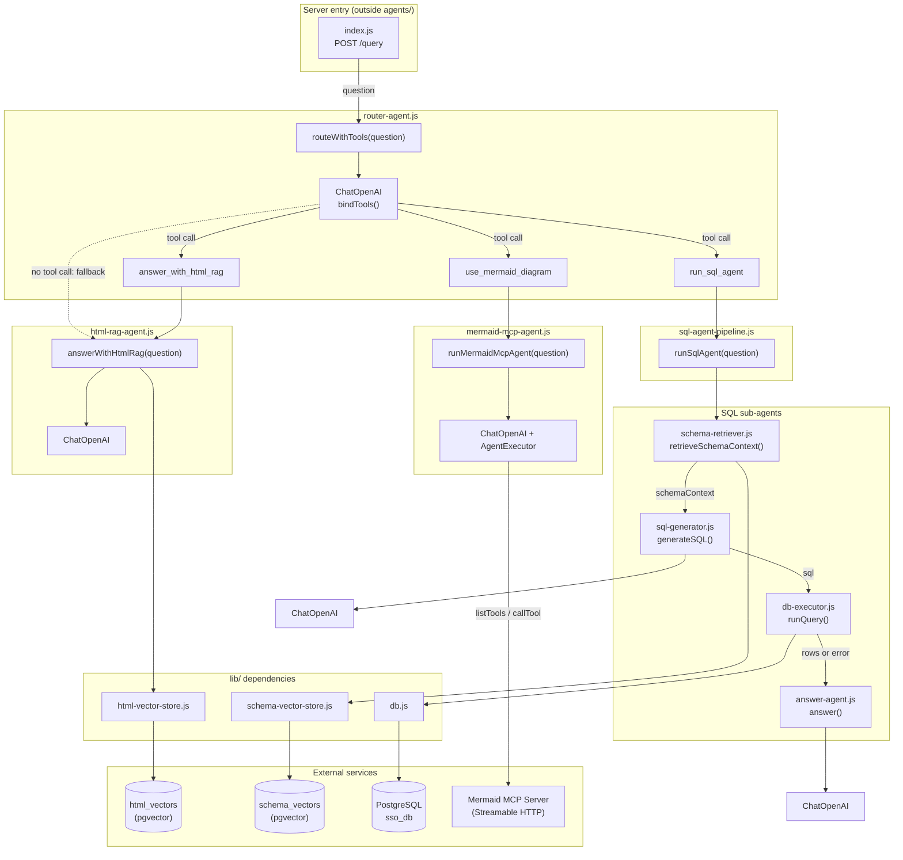
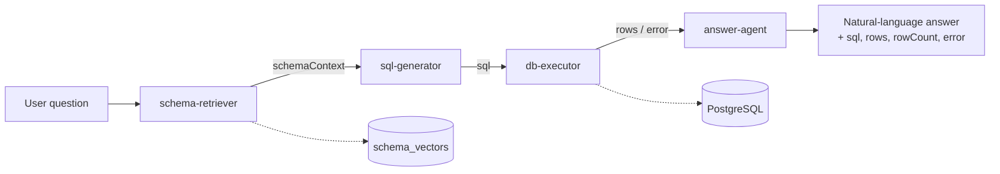
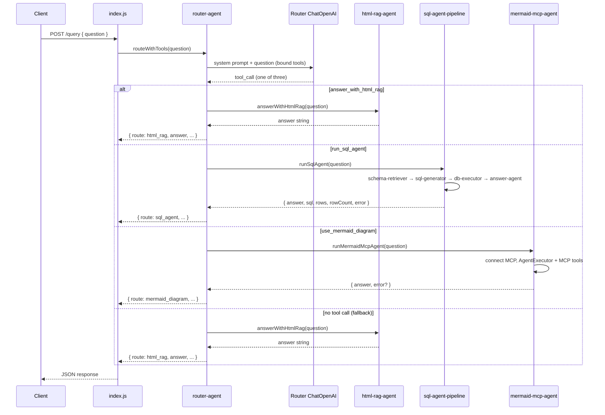

# Lab 8 — Agents Structure & Communications

Architecture of the multi-agent system in `server/agents/`. The **router** exposes each specialist agent as a LangChain tool; the router LLM picks exactly one tool per question.

## Agent dependency graph

## SQL agent pipeline (sequential flow)

## Router communications (sequence)

## Agent modules summary

| File | Exported function | Role | Uses LLM |
|------|-------------------|------|----------|
| `router-agent.js` | `routeWithTools` | Routes via tool-calling; wraps all other agents | Yes |
| `html-rag-agent.js` | `answerWithHtmlRag` | RAG over indexed HTML documentation | Yes |
| `sql-agent-pipeline.js` | `runSqlAgent` | Orchestrates SQL sub-agents | No (orchestrator only) |
| `schema-retriever.js` | `retrieveSchemaContext` | RAG over DB schema vectors | No |
| `sql-generator.js` | `generateSQL` | Generates SELECT from question + schema | Yes |
| `db-executor.js` | `runQuery` | Runs SQL via `lib/db.js` | No |
| `answer-agent.js` | `answer` | Summarizes query results in natural language | Yes |
| `mermaid-mcp-agent.js` | `runMermaidMcpAgent` | Tool-calling agent over Mermaid MCP tools | Yes |
